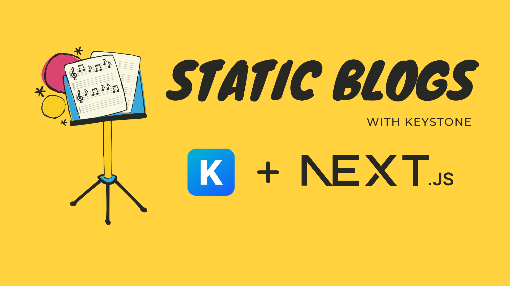

# Static Blogs with Keystone

    

This is a starter template to build statically generated blog-like websites with [Keystone](https://keystonejs.com/) and [Next.js](https://nextjs.org/). The template is built with and styled using [Tailwind's configuration based theme](https://tailwindcss.com/docs/theme) which makes it easy to extend and customise it.

> Check it out here — [Static Blogs with Keystone](https://staticblogswithkeystone.netlify.app).

## How does it work?

The short version is that the blog is entirely generated during build-time using Next.js static site generation and the content for the blog is made available during build-time using Keystone's powerful content server along with the magic of zero configuration file-system based SQLite database.

- The blog is generated statically using [Next.js static HTML export](https://nextjs.org/docs/advanced-features/static-html-export).

- The content for the blog is fetched from a [local Keystone server](https://keystonejs.com). Keystone is a fantastic content server that auto-magically generates GraphQL API based on schema definitions.

- Usually content servers need to be connected to a database and hosted somewhere which often comes with hosting, configuration and maintenance cost. [Keystone supports SQLite database](https://keystonejs.com/docs/apis/config#sqlite) and we make use of that to avoid having to configure, host or maintain anything. **You can get started with zero configuration and commit your database along with your code like any other file.** 🤯 This is what makes this whole _generate blogs locally without having to host a server anywhere_ possible.

- Author your content visually in your local environment using [Keystone's powerful document editor](https://keystonejs.com/docs/guides/document-field-demo) and admin dashboard. Once your content is ready, just run a local build and your blog will be exported as a static website. Now you can easily host this static website anywhere. I created [my blog](https://dineshpandiyan.com) using this template and hosted it in [Netlify](https://www.netlify.com/). Every time I make a change to my content, all I gotta do is push my changes to the repo and Netlify automatically deploys it in less than a minute.

- The generated blog and content is styled using [Tailwind](https://tailwindcss.com/) and could be easily customised easily.

## How is this different from mdx based blogs?

The idea is same - you statically generate your blog using content made available during build-time. The difference however, is that, MDX authored content is passed through a plugin system during the build and the content is made available in your pages to be built. This is easy as long as you only need the default out-of-the-box markdown syntax content. The moment you want to customise your content with fancier components (Eg. carousel, YouTube video, Twitter embed, syntax highlighted code, Hero image, etc) you will either have to find a plugin that supports that or build them yourself which sometimes can get quite cumbersome.

This is where [Keystone's all powerful document field](https://keystonejs.com/docs/guides/document-field-demo#document-fields-demo) comes into play. You can author content using a visual editor and see how your content is going to look while authoring it. And most importantly Keystone's document field makes it easy to add custom components (Eg. carousel, YouTube video, Twitter embed, syntax highlighted code, Hero image, etc). All you need to know to add a custom component is to know how to code in React and voila. 🥳 This template is setup with a few custom components (hero image, custom blockquote, embed tweet, embed youtube videos, callouts and syntax highlighted code blocks). You can see them in action here — [Keystone Content Authoring Experience is Just Fantastic!](https://staticblogswithkeystone.netlify.app/blog/keystone-content-authoring).

Keystone's document editor stands out in a handful of ways over MDX based content —

- Ability to visually see your content while authoring it.

- Keystone's admin dashboard makes it easy to publish/unpublish content, go through all your content visually for editing, author SEO information along with your post, etc.

- Complete control over how you render and style your content. Default out-of-the-box elements and your custom elements can be styled however you want.

- Multi-column layouts for your content.

- And more. Keystone's document editor is friggin' fantastic.

## Getting started

The project is a monorepo with Keystone server in `keystone-server` workspace and the next frontend in `blog-sleek` (any `blog-{theme}`) workspace.

You will need to have [yarn MacOS install using Homebrew](https://formulae.brew.sh/formula/yarn) installed in your machine to get started.

1. `yarn` at project root installs the dependencies for the server and all theme templates.

2. `yarn dev` at project root starts the Keystone server at http://localhost:3000 and the sleek template at http://localhost:8000

_Recommended approach is to open two terminal tabs and run yarn dev individually within `keystone-server` and `blog-sleek` (any `blog-{theme}`)  directories_.

### Authoring content

Open your keystone admin dashboard locally at http://localhost:3000 and start authoring content.

- If you want to create a new blog post, you can create one in **Posts**.

- If you want to link to an external blog post or a link you can create one in **Links**.

### Generating blog

Once your content is ready, keep the keystone server running and open the Next.js app at http://localhost:8000.

- Generate your blog by running `yarn export`. This will export your website in `blog-sleek/out` directory.

- You can check out your generated content locally by running `yarn serve` in `blog-sleek` dir.

### Deploying

The generated website is just a bunch of html, js and css files. You can host it where ever you want. You can choose one of these three methods to deploy.

**1. Build in local and push the built files to your repo**

You can run `yarn export` in your local environment and it will export the static website to `blog-sleek/out` dir. You can just commit these static files and ask your CI to deploy these files. _Eg. If you're using Netlify, you'll tell Netlify that just publish the files in `blog-sleek/out` dir on every new commit to the repo. Check netlify.toml file for more info on how to do it._

**2. Build in CI**

You can choose to automate your deploy process by building your website in a CI. There's a limitation with this though. During build, the content is fetched from a running local keystone server. Not all static hosting CI's support running a local server. So the build process needs to be dockerised. You will need to run `yarn export:docker` to build your website in a docker environment. But remember not all CIs support docker either. So if your CI supports docker, you can just run `yarn export:docker` in your CI and the site will be exported at `blog-sleek/out` dir. If your CI doesn't support docker (_like Netlify where this template is hosted_) you could use GitHub Actions to build your website in GitHub's CI and publish it to your hosting using their CLI. Eg. This template is hosted in Netlify, so there's a GitHub action at [.github/workflows/build-and-release.yml](.github/workflows/build-and-release.yml) that builds the website on every push to main and deploys to Netlify using Netlify's CLI.

## Where do I deploy?

The generated website is just a bunch of html, js and css files. You can host it where ever you want. Here are a few options that will automatically deploy the website as soon as you push the generated files to your repo.

- [Netlify](https://www.netlify.com/)
- [Vercel](https://vercel.com/)
- [Cloudflare Pages](https://pages.cloudflare.com/)
- [Fastly](https://docs.fastly.com/en/fundamentals/1-introduction)
- [AWS S3](https://aws.amazon.com/s3/)

## Easy deploy to Netlify using GitHub Actions (FREE)

The repo is setup with GitHub actions to auto deploy your blog to Netlify after each commit.

1. Create an account with Netlify.

2. Goto Netlify _User Settings -> OAuth -> Personal access tokens_ and create a new access token and copy the value.

3. Goto your GitHub repo _Settings -> Secrets -> Actions_ and add a new Repository Secret with name _NETLIFY\_AUTH\_TOKEN_ and paste the value your copied from step 2.

4. Go back to Netlify dashboard and create a new site (manual deploy site should be enough since we use GitHub Actions to deploy). After creating the site, open Site Settings and copy _Site ID_.

5. Go back to GitHub repo _Settings -> Secrets -> Actions_ and add a new Repository Secret with name _NETLIFY\_SITE\_ID_ and paste the value your copied from step 4.

You're all done now. Every time you commit a change to your repo GitHub actions will automatically deploy to your Netlify site. By default the action `.github/workflows/build-and-release.yml` will deploy `blog-sleek` but you can change it to whatever theme you want by editing the file. You can delete the other `.github/workflows/build-and-release-{theme}.yml` files because they are there only for demo purposes of the template repo.

## License

MIT © Dinesh Pandiyan
